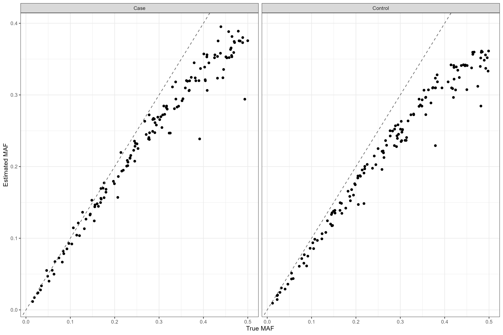
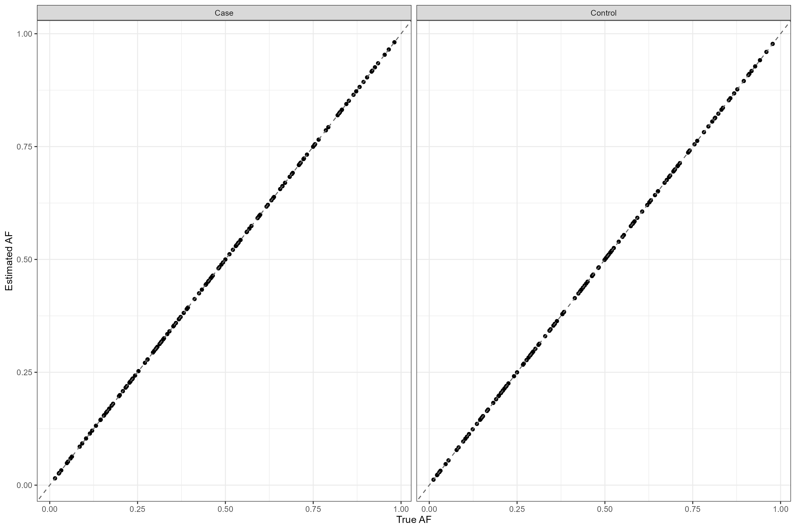

# CaseControlAF
Case Control AF Reconstruction R Package

This repository contains the source code for the CaseControlAF R package which can be used to reconstruct the AF for cases and controls separately given commonly available summary statistics. 

The package contains two functions:

1) CaseControl_AF
2) CaseControl_SE

## CaseControl_AF
Use this function when you have the following statistics (for each variant)
* Number of cases
* Number of controls
* OR or beta
* **AF** for the whole sample (cases and controls combined)

### Usage
**N_case**: an integer for the number of case samples

**N_control**: an integer for the number of control samples

**OR**: a vector of doubles with the OR for each variant

**AF_population**: a vector of doubles with the AF for each variant

**Return**: Returns a dataframe with two columns with names: AF_case and AF_control. The number of rows is equal to the number of variants

## CaseControl_SE
Use this function when you have the following statistics (for each variant)
* Number of cases
* Number of controls
* OR or beta
* **SE** of the log(OR) for each variant

*Code adapted from ReACt GroupFreq function available here: [(https://github.com/Paschou-Lab/ReAct/blob/main/GrpPRS_src/CountConstruct.c)]*

### Usage
**N_case**: an integer for the number of case samples

**N_control**: an integer for the number of control samples

**OR**: a vector of doubles with the OR for each variant

**SE**: a vector of doubles with the SE(log(OR)) for each variant

**Return**: Returns a dataframe with three columns with names: pCase, pControl and pPop. The number of rows is equal to the number of variants
**NOTE:** This method assumes we are estimating the minor allele frequency 

## A small example

``` r
# load the data
data("SampleDat")

nCase_sample = 79148
nControl_sample = 61106

head(SampleDat)
#  rsid case_af control_af case_maf control_maf     SE   OR
#1    1  0.6917     0.6825   0.3083      0.3175 0.0086 1.18
#2    2  0.2295     0.2181   0.2295      0.2181 0.0096 1.07
#3    3  0.4580     0.4467   0.4580      0.4467 0.0080 1.05
#4    4  0.7554     0.7379   0.2446      0.2621 0.0091 1.10
#5    5  0.3675     0.3575   0.3675      0.3575 0.0083 1.06
#6    6  0.7141     0.6995   0.2859      0.3005 0.0087 1.07

se_method_results <- CaseControl_SE(N_case = nCase_sample,
                                    N_control = nControl_sample,
                                    OR = SampleDat$OR,
                                    SE = SampleDat$SE)

head(se_method_results)
#      pCase  pControl      pPop
#1 0.2721196 0.2637265 0.2684629
#2 0.2013120 0.1909652 0.1968041
#3 0.3521112 0.3417763 0.3476085
#4 0.2354858 0.2192349 0.2284056
#5 0.3058994 0.2967891 0.3019302
#6 0.2657115 0.2521924 0.2598215
```


``` r
# calculate whole sample true AF
SampleDat$true_AF <- (SampleDat$case_af * nCase_sample + SampleDat$control_af * nControl_sample)/(nCase_sample + nControl_sample)

af_method_results <- CaseControl_AF(N_case = nCase_sample,
                                    N_control = nControl_sample,
                                    OR = SampleDat$OR,
                                    AF_population = SampleDat$true_AF)
head(af_method_results)
#  AF_case AF_control
#1  0.6917     0.6825
#2  0.2295     0.2181
#3  0.4580     0.4467
#4  0.7554     0.7379
#5  0.3675     0.3575
#6  0.7141     0.6995
```


